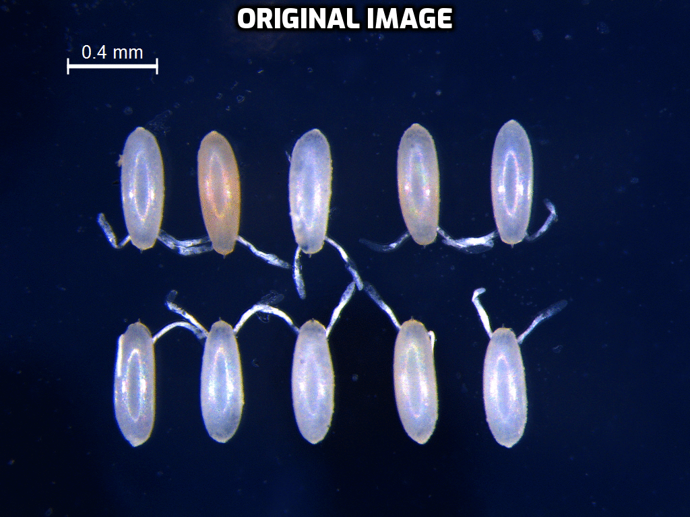

# egg-dimensions

Measure *Drosophila* egg (or any other eggs with antennas ¯\_(ツ)_/¯) dimensions from images using OpenCV

* Clone and extract the repository.

* Install dependencies by running the shell script `install-dependencies.sh`:
```
./install-dependencies.sh
```
* Put images of the eggs to be measured in the `toMeasure` directory.

* Run the python script `measure-eggs.py`:
```
python3 measure-eggs.py
```

* The script would output all the names of all the images in `toMeasure` directory as list and ask for the scale of the images. Input a number corresponding to the scale of the images.

* The measured dimensions would be stored in a CSV file `egg_dimensions.csv` and the final images with dimension boxes around the eggs would be stored in a directory named `Measured`.

* Note: The images should contain a scale indicator on the left-hand-side.

* The code was written to fulfill the requirements of a specific use case. So it might not work as smoothly for your images. Feel free to PR and make changes. :)


